# Veridapt

**Privacy-Preserving Compliance Oracle Network on Supra L1**

Portable ZK-KYC • Automated Compliance • Institutional-Grade Onchain Finance

[](LICENSE)

## ✨ Live Demo
(Coming soon – deploying to Supra Testnet)

## 🎯 Key Features

- **ZK Proof Generation**: Generate zero-knowledge proofs for compliance predicates (age, KYC, accreditation, sanctions, jurisdiction) without revealing personal data
- **Portable Verifiable Credentials**: One attestation works across any chain (Supra, Ethereum, Polygon, Solana) — no repeated KYC
- **Automated Onchain Enforcement**: Smart contracts automatically gate transactions based on compliance status
- **Enterprise SaaS Dashboard**: Push.org Rewards-inspired interface for credential management, analytics, and custom predicates
- **Rewards & Compliance Score System**: Earn rewards for network participation; maintain onchain reputation score (privacy-preserving)

## 📸 Logo



## 🚀 Quick Start (After Code is Added)

### Frontend (Next.js 15)
```bash
cd frontend
npm install
npm run dev
# Open http://localhost:3000
```

### Smart Contracts (Foundry)
```bash
cd contracts
forge install
forge build
forge test
forge script scripts/deploy.js --network supra-testnet
```

### ZK Circuits (Noir)
```bash
cd circuits
nargo compile
nargo test
nargo prove
```

## 📚 Quick Links

- [📖 Whitepaper](./WHITEPAPER.md) — Full vision, architecture, tokenomics
- [🏗️ Architecture](./docs/architecture.md) — 6-layer system design
- [💰 Tokenomics](./docs/tokenomics.md) — VERI token economics
- [🗺️ Roadmap](./docs/roadmap.md) — Phase-gated delivery plan
- [📂 Contracts](./contracts/) — Smart contract suite
- [⚙️ Circuits](./circuits/) — Noir ZK predicates
- [🎨 Frontend](./frontend/) — Next.js dashboard
- [🔧 Scripts](./scripts/) — Deployment automation

## 🛠️ Tech Stack

| Layer | Technology |
|-------|-----------|
| Blockchain | **Supra L1** (500k+ TPS, sub-second finality) |
| Smart Contracts | **Solidity** (SupraEVM) |
| ZK Circuits | **Noir** |
| Frontend | **Next.js 15** + Tailwind + Wagmi |
| Data Oracle | **Supra Native Oracles** |
| Cross-Chain | **SupraNova** bridge |
| Token | **VERI** (Utility + Governance) |

## 🎯 Vision

**One ZK proof. Global compliance. Zero repeated KYC.**

Veridapt solves the last-mile regulatory bottleneck for tokenized finance by making compliance private, portable, and programmable.

## 📊 Roadmap Snapshot

| Phase | Timeline | Key Deliverables |
|-------|----------|------------------|
| **Phase 1** | Q3–Q4 2026 | MVP on Supra Testnet (age + KYC proofs, dashboard) |
| **Phase 2** | Q1 2027 | Mainnet launch, VERI token, first enterprise pilots |
| **Phase 3** | 2027–2028 | Global expansion (40+ predicates, cross-chain, $1B+ TVL target) |
| **Phase 4** | 2028+ | Full DAO governance, decentralized issuer network |

## 💡 Revenue Model

- **Usage Fees**: Per ZK proof / attestation verification
- **Enterprise Subscriptions**: SaaS dashboards, custom predicates, SLAs
- **Premium Services**: Insurance, custom circuits, regulatory consulting

**Projected Year 5 Revenue:** $200M+ at modest market share

## 🤝 Use Cases

- 🏦 **RWA Tokenization**: KYC once, trade globally
- 💳 **DeFi Onboarding**: Permissioned lending & derivatives with compliance gates
- 🏢 **Institutional Finance**: Treasury, settlement, and custody with automatic compliance
- 🌍 **Cross-Border Payments**: Sanctions screening + jurisdiction verification
- 📊 **Investment Platforms**: Accreditation & investor tier verification

## 🔐 Security & Privacy

- Zero-knowledge proofs ensure PII is never exposed
- Sybil-resistant network design
- Threshold encryption for regulated "break-glass" access
- Formal verification for critical contract paths
- Regular security audits (Code4rena, Spearbit)

## 📖 Documentation

- [Architecture Deep-Dive](./docs/architecture.md)
- [Tokenomics & Incentives](./docs/tokenomics.md)
- [Full Roadmap](./docs/roadmap.md)
- [Contract Suite](./contracts/src/README.md)
- [ZK Circuits](./circuits/README.md)
- [Frontend Setup](./frontend/README.md)

## 🌐 Community

- **Discord**: Coming soon
- **Telegram**: Coming soon
- **X (Twitter)**: [@veridapt](https://x.com/veridapt)
- **Email**: hello@veridapt.com

## 📄 License

MIT License — see [LICENSE](LICENSE) file for details.

---

**Veridapt: Verify Once. Comply Everywhere.**

*Building the trust and compliance infrastructure for the tokenized economy.*
